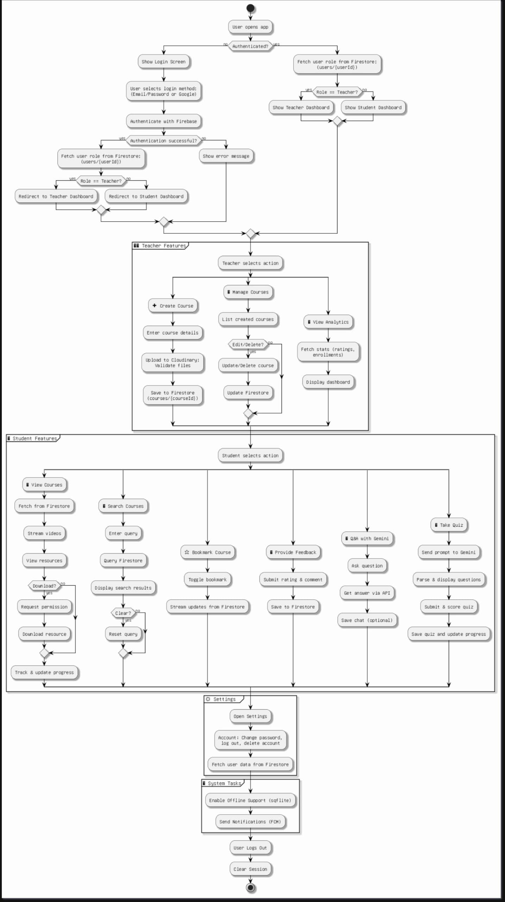
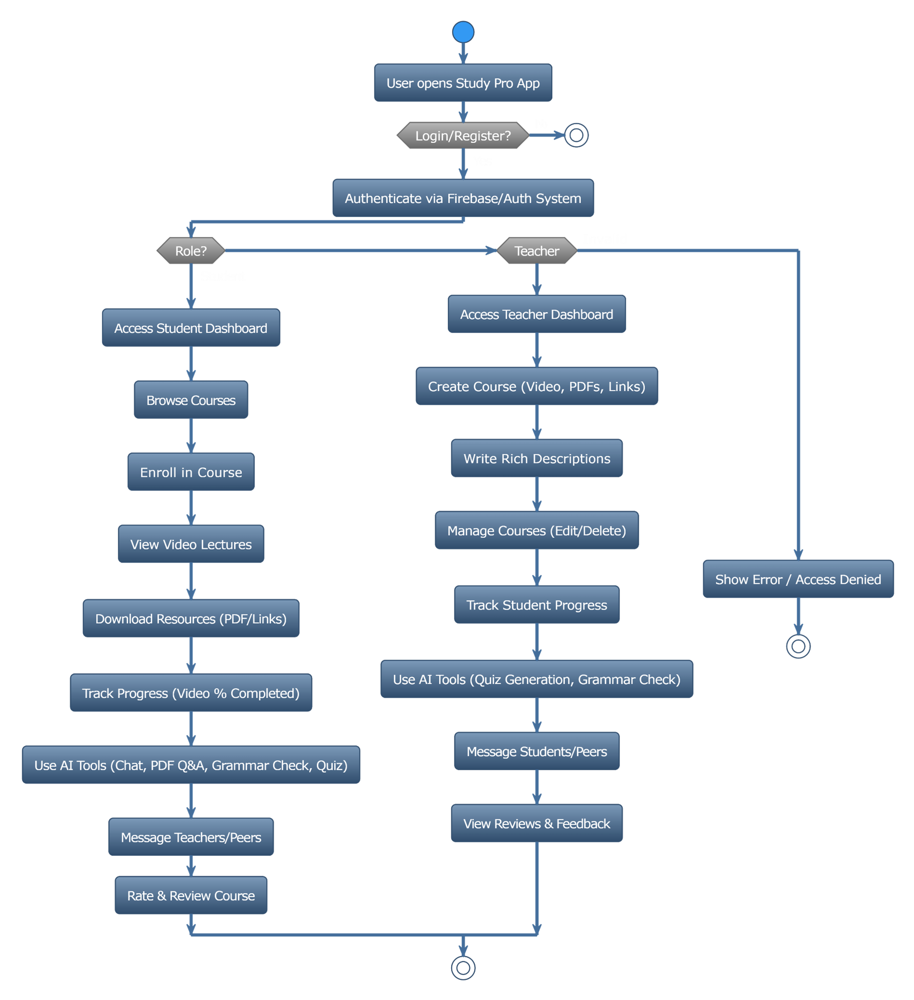
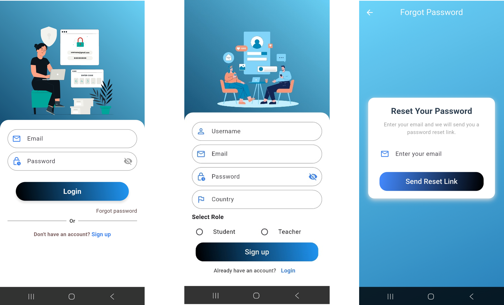
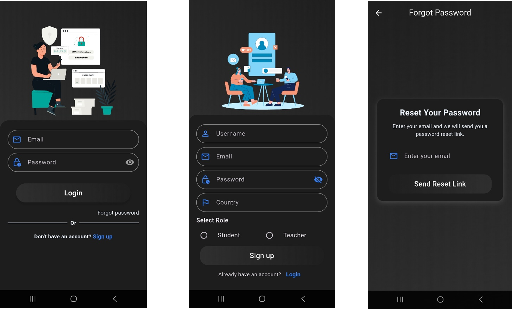
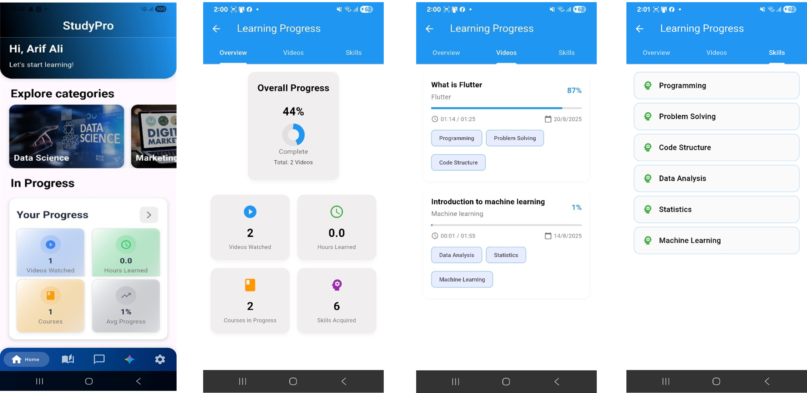
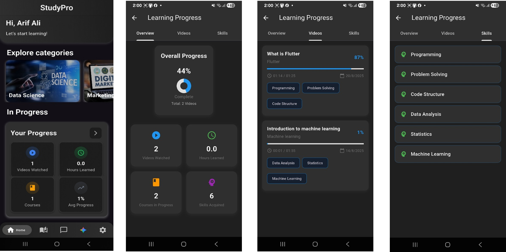
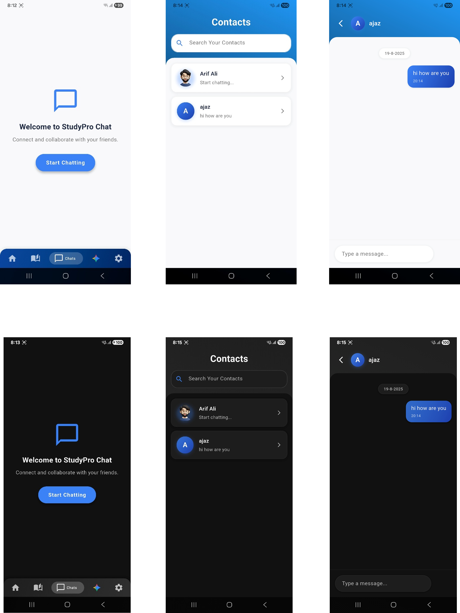
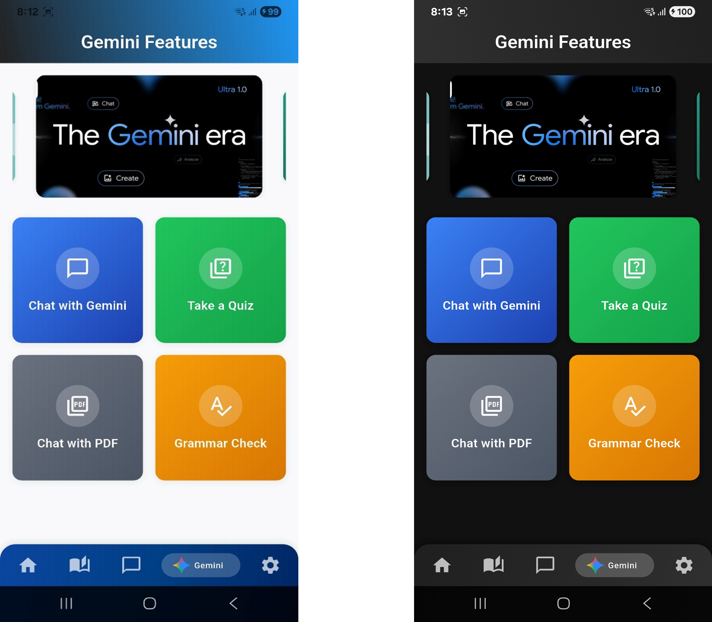
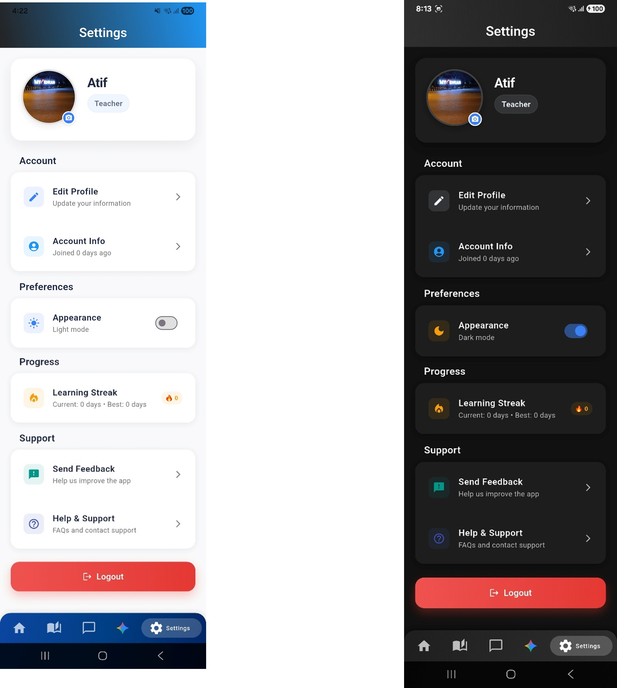

# 📘 Study Pro – AI-Powered E-Learning Platform

Study Pro is a next-generation **e-learning platform** that bridges the gap between **teachers and students** through comprehensive course management, **AI-powered learning tools**, and an intuitive user experience.

---

## 📑 Table of Contents
1. [🚀 Project Overview](#-project-overview)
2. [📐 Architecture & System Design](#-architecture--system-design)
3. [📱 User Interface Documentation](#-user-interface-documentation)
4. [🔗 API Integration](#-api-integration)
5. [📄 Documentation & Resources](#-documentation--resources)

---

## 🚀 Project Overview

### 📌 Summary
**Study Pro** is designed to make online learning **interactive, personalized, and efficient**.  
It empowers both **students** and **teachers** with modern tools, progress tracking, and AI-driven support.

### ✨ Key Features
- 🎥 **Course Management**: Upload videos, PDFs, and external resources  
- 🧑‍🎓 **Role-Based Dashboards**: Dedicated interfaces for students & teachers  
- 🤖 **AI Features** (Powered by Google Gemini API):  
  - AI Chat (Text & Images)  
  - PDF Understanding (Ask questions directly from docs)  
  - Grammar Checking  
  - Quiz Generation  
- 💬 **Social Learning**: Real-time messaging, reviews, ratings  
- 📊 **Progress Tracking**: Video completion tracking & performance insights  

### 🛠 Tech Stack
- **Frontend**: Flutter  
- **Backend**: Firebase Auth & Firestore  
- **Database**: NoSQL (Cloud Firestore)  
- **AI Integration**: Google Gemini API  

---

## 📐 Architecture & System Design

### 📊 Activity Diagram

  

### 🔄 Flowchart

  

---

## 📱 User Interface Documentation

### 🔐 Authentication Screens
> Login, Sign Up, Forgot Password – all integrated with **Firebase Authentication**

  
  

---

### 🏠 Home & Dashboards
- Course Categories  
- Student Dashboard (progress overview)  
- Detailed Insights (videos watched, skills acquired)  

  
  

---

### 📚 Course Details & Video Player
- Course discovery & structured video playlists  
- Reviews & ratings  
- Resource downloads + external links  

  

---

### 💬 Chatting
- Real-time messaging between students  
- Simple, clean, structured chat interface  

  

---

### 🤖 AI-Powered Features
- Chat with Gemini (text & images)  
- Chat with PDF (document Q&A)  
- Grammar check & improvements  
- Automatic quiz generation  

  

---

### ⚙️ Settings
- Profile management (photo upload)  
- Dark/Light theme toggle  
- Help & support access  
- App reviews & feedback  
- Learning streaks for motivation  
- Secure logout  

  

---

## 🔗 API Integration
- **Firebase Authentication** → User sign-in & account management  
- **Firestore Database** → Courses, chats, and user profiles  
- **Google Gemini API** →  
  - AI chat (text/image)  
  - PDF Q&A  
  - Grammar correction  
  - Quiz generation  

---

## 📄 Documentation & Resources
📕 **Full Project Report (Google Doc)**  
[View Report](https://docs.google.com/document/d/1vDTlPQiT5QHVJ9r6AWKR028hCWY5Q2qX/edit?usp=sharing)  

🎥 **Demo Video (Google Drive)**  
[Watch Video](https://drive.google.com/file/d/1Na6Rf-xBW6lTXv_DSmQtJs6qvxm9ZHbD/view?usp=sharing)  

---

## 👥 Team
- **Ghazanfar Ali**  
- **Tahira Kainat**  

⭐ If you like this project, don’t forget to **star the repo** and share it with others!
# StudyPro